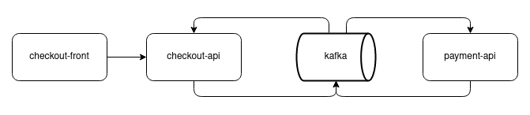

# E-commerce microservices in Java

<p align="center">
  
</p>


## Technologies:

* Java 11
* Maven 3.6.3
* Spring Cloud
* Kafka/Zookeeper
* Postgres
* Avro

## Run project:
- Run `docker-compose up --build -d` inside docker folder for start kafka, zookeeper, checkout and payment databases
- Run `mvn spring-boot:run` inside checkout for run checkout-api
- Run `mvn spring-boot:run` inside payment for run payment-api


### Frontend request

- POST /v1/checkout/ HTTP/1.1
- Host: localhost:8085
- Content-Type: application/json
- URL: http://localhost:8085/v1/checkout/

``` json
{
	"firstName":"Neto",
	"lastName":"Deolino",
	"email":"neto@email.com",
	"address":"River Fortaleza",
	"complement":"AP",
	"country":"Brazil",
	"state":"CE",
	"cep":"30303030",
	"saveAddress":"",
	"saveInfo":"",
	"paymentMethod":"CREDIT",
	"cardName":"123456789123456",
	"cardNumber":"123456",
	"cardDate":"0120",
	"cardCvv":"111",
	"products":[
		"mouse", "notebook"
	]
}
```